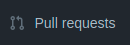
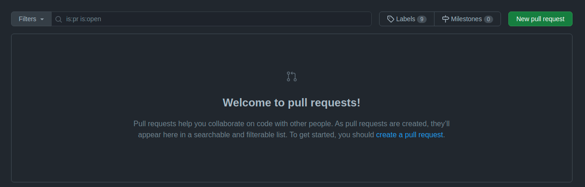
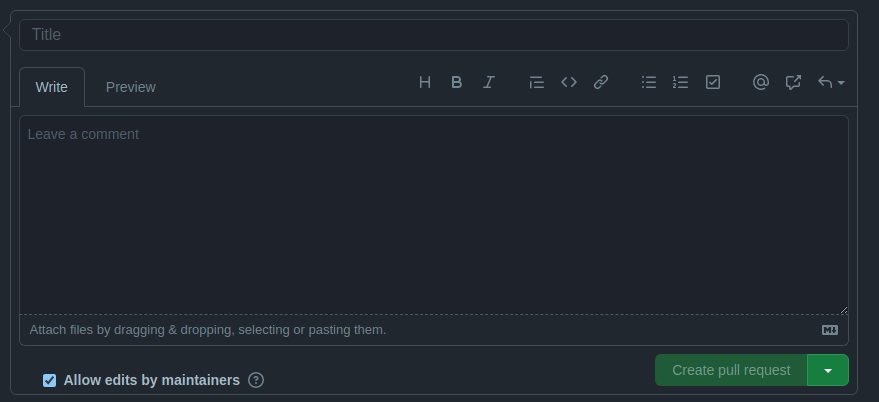

# Seu primeiro Pull request
Com intuito de incentivar a contribuir em projetos opensource no github, este repositório ira te ensinar a fazer seu primeiro Pull Request
caso ainda não tenha feito e incentivar a contribuir em outros projetos.

## Passo a passo
Primeira mente, faça um fork deste projeto clicando em <b>Fork</b> 
<br/> <br/><br/> 

Repare que na sua lista de repositorios, tera um novo repositorio com mesmo nome deste e indicando que esta "forkado",
<br/>Com este por exemplo: &nbsp;&nbsp;<br/><br/>

Agora adicione seu nome e link para seu github na lista de pessoas usando " * [seunome] (link) " como no exemplo abaixo:
<br/><br/>

Adicionado seu nome e link para seu github, vamos commitar e subir.
```bash
# Adicionar
git add README.md

# Commitar
git commit -m "add *seu nome* "

# Subir para repositorio
git push origin master
```

Agora vamos ao que realmente interessa, fazer nosso <b>Pull request</b>. basta acessarmos nosso repositorio que foi forkado e clicar em: <br/><br/>
Voce vera uma tela semelhante a esta:
<br/><br/>
Clicando em <b>New pull request</b>, voce vera uma tela de comparação das mudanças que voce tem feito. Ja verificado as mudanças se estão corretas, clique em <b>Create pull request</b>.
<br/>

Agora vamos dar um Titulo e um resumo para nosso pull request, afim de quem for revisar o pull request consiga entender a sua ideia.
<br/><br/>
Preenchido corretamente, podemos finalizar clicando em <b>Create pull request</b>
<br/><br/>

## Contribuição 
Caso deseja contribuir com este projeto seja o que for, estará aberto a Pull request
<br/><br/>

## Lista pessoas
* [Matheus fortunato](https://github.com/mfortunat0)
* [Victor Taveira](https://github.com/viktortav)
* [Diego Melo](https://github.com/iTPr0)
